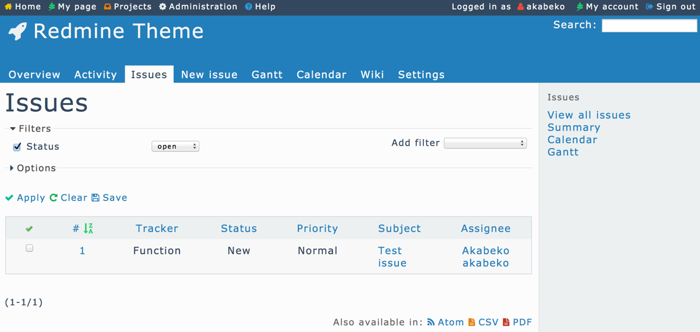

# minimalflat

Minimal and flat design Redmine theme.

# Feature

* Minimal and flat design
* Modern color scheme by [Flat UI](http://designmodo.github.io/Flat-UI/)
* Flexible ( resolution-independent ) icon by [Font Awesome](http://fortawesome.github.io/Font-Awesome/)

# Screenshot

# Installation

1. Download archive ( minimalflat-vX.X.X.zip ) from [release page](https://github.com/akabekobeko/redmine-theme-minimalflat/releases)
2. Extract archive, and move to `public/themes/minimalflat` at Redmine directory
3. Open Redmine page, and go to **Administration > Settings > Display**
4. Enable the **minimakflat** from **Theme**

# License

* [GNU GENERAL PUBLIC LICENSE Version 2](LICENSE)

# Change log

* 2014/3/30: v1.0.0 release
